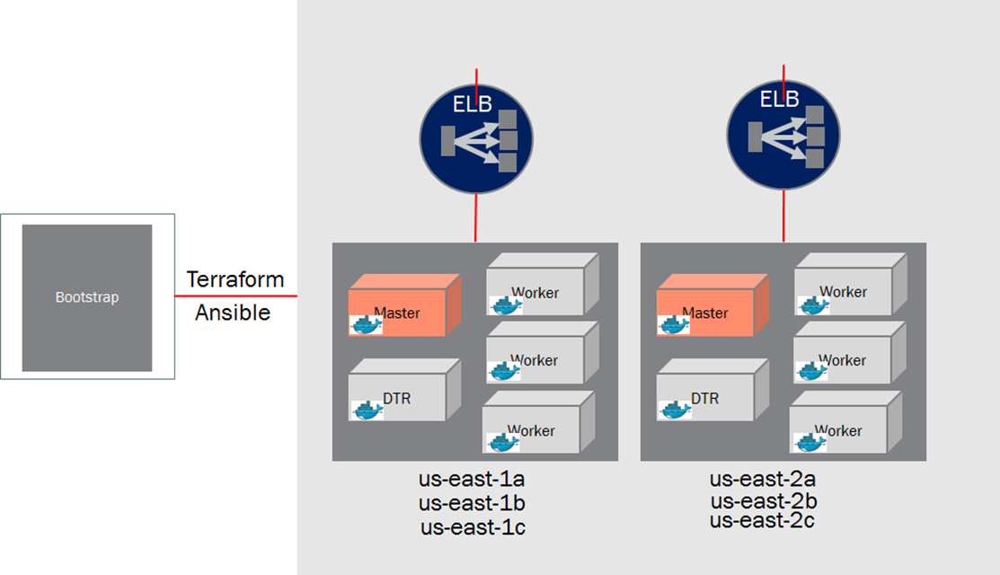
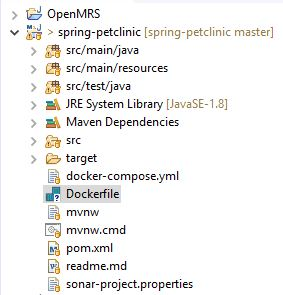

# Docker tools, application containerization and CI/CD 

This details the steps in containerizing a custom web application like for Spring Petclinic, the tools used and the CI/CD pipeline for delivering the application using Jenkins.

## Tools
Install following Developer tools on your laptop or workstation
* Java/JDK
* Maven
* Git
* Docker for Windows
   - Choose Edge for installing Kubernetes along with Docker swarm
* Eclipse or IntelliJ
   - Git Connector
   - Docker tooling for eclipse


## Docker EE setup on AWS

Use terraform to automate infrastructure provisioning and ansible playbooks to automate provisioning of the Docker EE platform.


## Spring Petclinic demo application and Dockerfile
1. From eclipse retrieve spring petclinic application from github by selecting File --> New Project --> Maven --> Check out Maven Projects from SCM.      Select git from the SCM URL dropdown and paste https://github.com/spring-projects/spring-petclinic.git as the git location. Click next and then Finish.<br/>
2. Add a Dockerfile as shown below to the project root folder<br/>


	FROM maven:3.3.9-jdk-8-onbuild AS petclinicbuild
	WORKDIR /usr/petclinic
	COPY pom.xml .
	COPY settings.xml /usr/share/maven/ref/
	ADD src /usr/petclinic/src
	RUN mvn -B -s /usr/share/maven/ref/settings.xml package –DskipTests
	
	FROM tomcat:7-jre8
	COPY tomcat-users.xml /usr/local/tomcat/conf/
	COPY --from=0 /usr/petclinic/target/petclinic.war /usr/local/tomcat/webapps/petclinic.war
	EXPOSE 8080

## Build, Deploy and Run Docker image
1. Login to DTR (or private Docker registry) through powershell
	<i>docker login hub.docker.com</i>
	
2. Build the image
	<i>docker build -t {$user-name}/{$registry-name}:{$tag-no} .</i>
   List the images
   	<i>docker images</i>
	
3. Run container
	<i>docker run -d -p {$host_port}:{$container_port} --name petclinic {$user-name}/{$registry-name}:{$tag-no}</i>

4. Verify application at <i>http://localhost:{$host_port}/petclinic</i>

5. Once the application is verified push the Docker image to registry
	<i>docker push {$user-name}/{$registry-name}:{$tag-no}</i>

## Starting services locally with docker-compose
	version: '3'

	services:  

	   db:
	     image: mysql:5.7
	     volumes:
	       - db_data:/var/lib/mysql
	     restart: always
	     environment:
	       MYSQL_ROOT_PASSWORD: petclinic123
	       MYSQL_DATABASE: petclinic
	       MYSQL_USER: root 

	  web:
	    depends_on:
	      - db  
	    expose:
	      - 8009
	    image: bewinsto7604/petclinic-demo-oct:4.3.17-RELEASE  

	  httpd:
	    depends_on:
	      - web  
	    volumes:
	      - ./logs:/var/log/apache2
	    ports:
	      - 80
	      - 443
	    image: bewinsto7604/dockerhttpdtomcat_httpd:0.5	

## Understanding the Spring Petclinic application with a few diagrams
<a href="https://speakerdeck.com/michaelisvy/spring-petclinic-sample-application">See the presentation here</a>

You can then access petclinic here: http://localhost:8080/


## In case you find a bug/suggested improvement for Spring Petclinic Microservices

Our issue tracker is available here: https://github.com/spring-petclinic/spring-petclinic-microservices/issues

## Database configuration

In its default configuration, Petclinic uses an in-memory database (HSQLDB) which
gets populated at startup with data. A similar setup is provided for MySql in case a persistent database configuration is needed.
Note that whenever the database type is changed, the data-access.properties file needs to be updated and the mysql-connector-java artifact from the pom.xml needs to be uncommented.

You may start a MySql database with docker:

```
docker run -e MYSQL_ROOT_PASSWORD=petclinic -e MYSQL_DATABASE=petclinic -p 3306:3306 mysql:5.7.8
```

## Looking for something in particular?

| Spring Cloud components | Resources  |
|-------------------------|------------|
| Configuration server    | [Config server properties](spring-petclinic-config-server/src/main/resources/application.yml) and [Configuration repository](https://github.com/spring-petclinic/spring-petclinic-microservices-config) |
| Service Discovery       | [Eureka server](spring-petclinic-discovery-server) and [Service discovery client](spring-petclinic-vets-service/src/main/java/org/springframework/samples/petclinic/vets/VetsServiceApplication.java) |
| API Gateway             | [Zuul reverse proxy](spring-petclinic-api-gateway/src/main/java/org/springframework/samples/petclinic/api/ApiGatewayApplication.java) and [Routing configuration](https://github.com/spring-petclinic/spring-petclinic-microservices-config/blob/master/api-gateway.yml) |
| Docker Compose          | [Spring Boot with Docker guide](https://spring.io/guides/gs/spring-boot-docker/) and [docker-compose file](docker-compose.yml) |
| Circuit Breaker         | TBD |
| Graphite Monitoring     | TBD |

 Front-end module  | Files |
|-------------------|-------|
| Node and NPM      | [The frontend-maven-plugin plugin downloads/installs Node and NPM locally then runs Bower and Gulp](spring-petclinic-ui/pom.xml)  |
| Bower             | [JavaScript libraries are defined by the manifest file bower.json](spring-petclinic-ui/bower.json)  |
| Gulp              | [Tasks automated by Gulp: minify CSS and JS, generate CSS from LESS, copy other static resources](spring-petclinic-ui/gulpfile.js)  |
| Angular JS        | [app.js, controllers and templates](spring-petclinic-ui/src/scripts/)  |